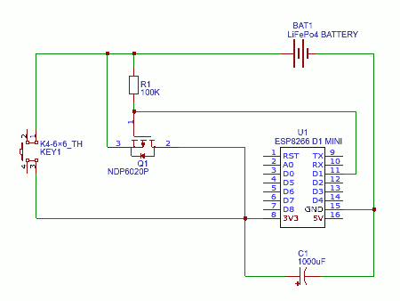

# ActButton

It is a software for MQTT button.
On pressing button it:
* switches its power on
* connects to a Wifi
* connects to a MQTT server
* sends a message to a topic (voltage * 1000)
* switches itself off

(above takes several seconds)

# Setup

If the button was not setup or can not connect to wifi or you continue to
press button for long time (about 12 sec) it will create Wifi network for
setup (then you can release button).

Default wifi for setup is "ActButton" and password is "ab1234567890ab" (it
can be changed in setup). When you connect to the setup Wifi all web
connections will redirected to the button setup web page.
On the setup page there is http buttons:
* OK - save parameters and shutdown
* CANCEL - shutdown
* RESET - remove setup (format data partition of the esp8266 flash) and shutdown

# Hardware

* D1 Mini ESP8266 module
* LiFePo4 14500 (500mAh) battery
* ndp6020p MOSFET
* 1000 µF Electrolitic capasitor
* push button

# Circuit

Idea by Andreas Spiess ( https://www.youtube.com/channel/UCu7_D0o48KbfhpEohoP7YSQ )

